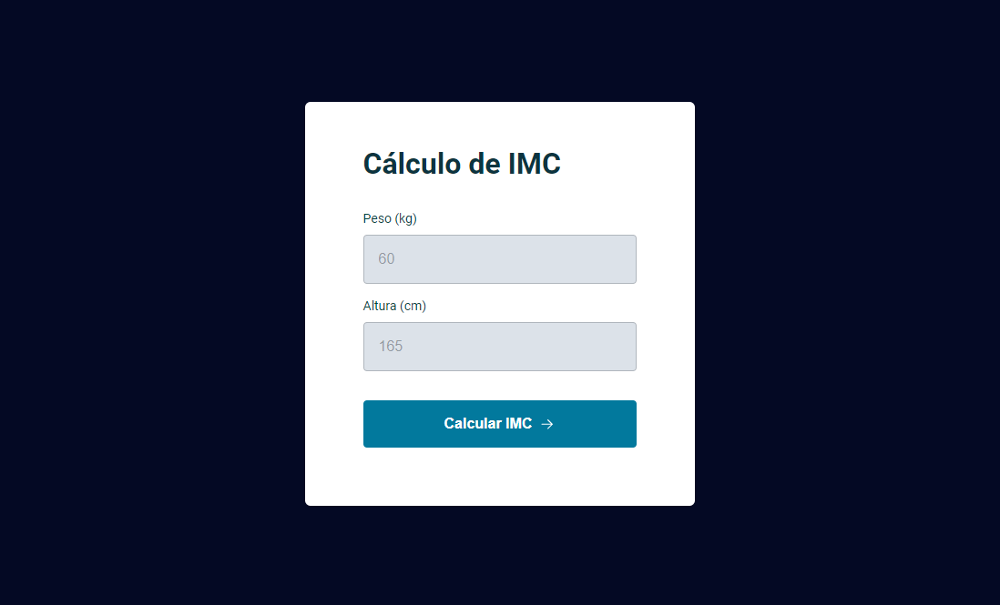

# Calculadora de IMC

> Turma Explorer 2.0

Projeto desenvolvido nas aulas da RocketSeat onde fizemos uma calculadora de IMC para aprender ES6 Modules.

[🔗 Clique aqui para acessar](https://rildojunior.github.io/calculator-imc/)

## 🛠️ Tecnologias

- HTML
- CSS
- Javascript
- ES6 Module

## ✉️ Contato

rildojuniorcontato@gmail.com
